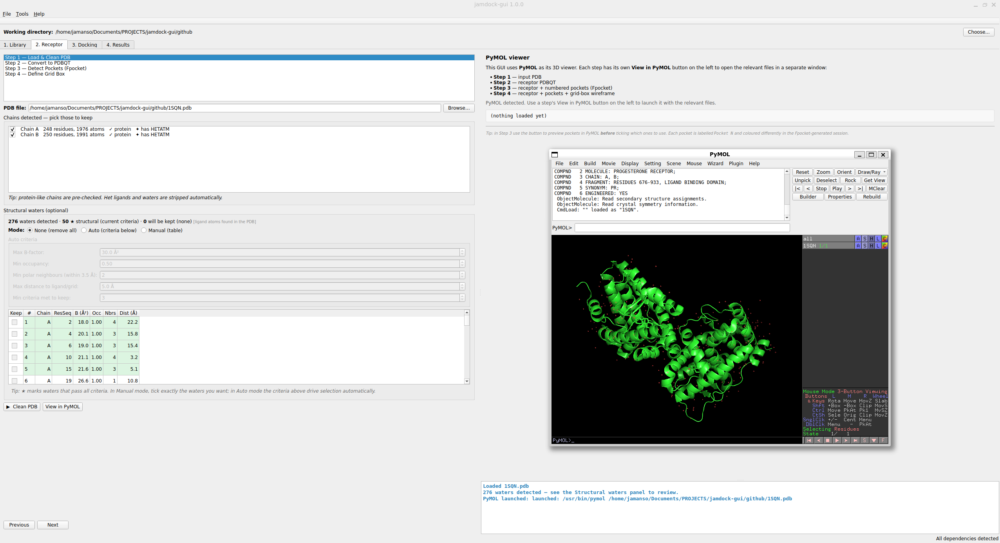
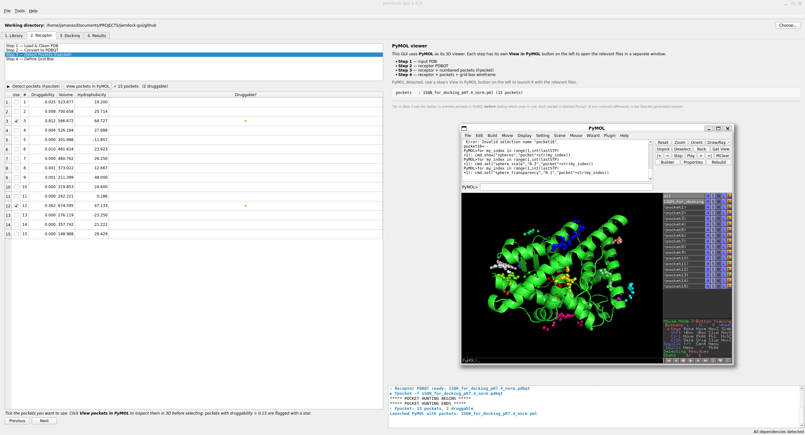
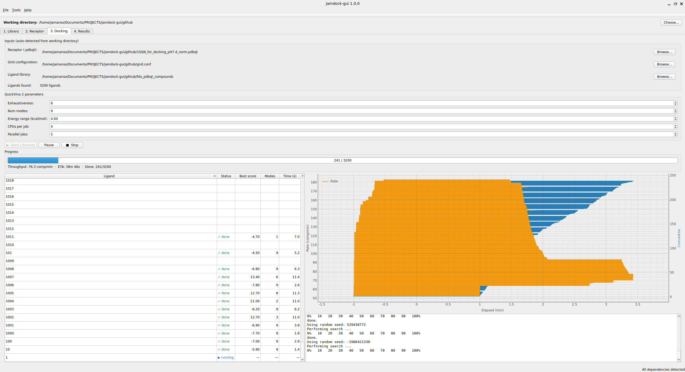
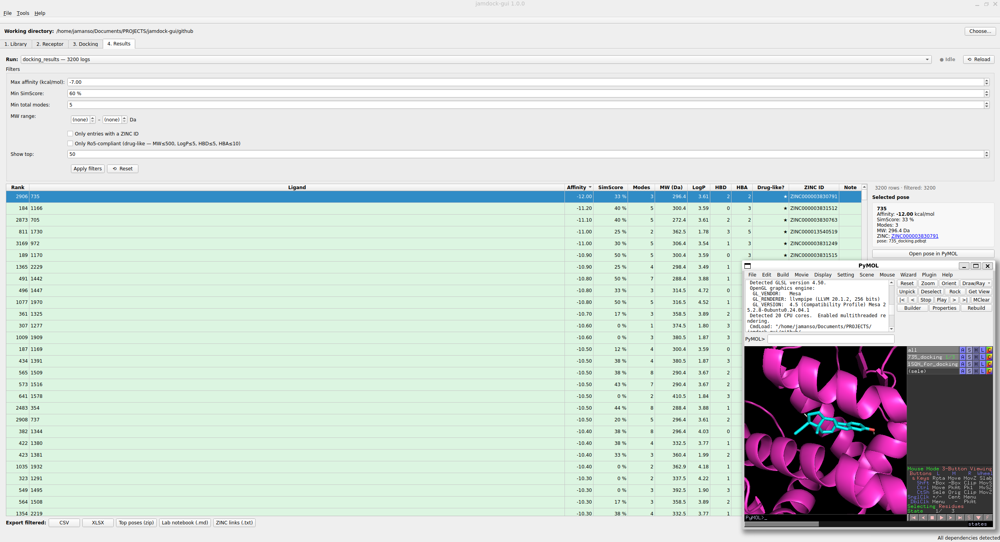

# jamdock-gui

[](https://doi.org/10.5281/zenodo.20268820)
[](https://github.com/jamanso/jamdock-gui/actions/workflows/ci.yml)
[](https://creativecommons.org/licenses/by-nc/4.0/)

Graphical interface for [jamdock-suite](https://github.com/jamanso/jamdock-suite) — an end-to-end pipeline for **automated virtual screening** built around **QuickVina 2**.

## Screenshots

<table>
  <tr>
    <td width="50%" align="center">
      
    </td>
    <td width="50%" align="center">
      
    </td>
  </tr>
  <tr>
    <td width="50%" align="center">
      
    </td>
    <td width="50%" align="center">
      
    </td>
  </tr>
</table>

## What's new in jamdock-gui (vs. the jamdock-suite CLI)

This GUI is more than a button-wrapper for the bash scripts. It adds capabilities that were impractical to bolt onto the original CLI:

- **Full graphical environment** — PySide6 desktop application with four task-oriented tabs (Library, Receptor, Docking, Results), persistent settings, a built-in dependency checker, and an integrated log console. CLI users can keep using the scripts as-is; nothing in the suite is removed.
- **Structural-water handling** — `jamreceptor` strips every water by default. The GUI ships a dedicated module (`core.waters`) that **detects** crystallographic waters in the input PDB, **scores** each one against four cheap structural criteria (B-factor, contact count, distance to pocket centroid, H-bond geometry), **filters** by user-tunable thresholds, and **injects** the surviving "bridge" waters back into the cleaned PDB so they participate in the docking. This typically rescues 1–2 kcal/mol of binding free energy that pure dry docking misses.
- **Titratable-residue protonation at user-selected pH** — optional PDB2PQR + PROPKA stage that adjusts the protonation states of HIS, ASP, GLU, CYS, LYS, ARG and TYR for the experimental pH.
- **Click-to-pick PyMOL viewer everywhere** — fully integrated PyMOL panel that you can drive with one click from any tab:
  - **Protein view**: chains and ligands are shown side by side; click a chain to keep it, click a pocket detected by Fpocket to use it as the binding site for the grid.
  - **Pocket preview**: every Fpocket cavity is rendered with its surface so you can compare them visually before choosing one.
  - **Pose inspection**: click any row in the Results table and the receptor + that exact pose load into PyMOL ready for inspection.
- **CPU parallelization of QuickVina jobs** — the Python orchestrator that replaces `jamqvina` runs `qvina02` in a configurable worker pool sized to the host's CPU count. Live throughput chart, accurate ETA, pause/resume, and crash recovery (so the old `jamresume` is no longer needed) deliver a measured **3–4× speed-up** vs. the serial bash version on multi-core machines.
- **Live, in-place results analysis** — as each docking job finishes, its results stream into the Results table without waiting for the batch to end. Each row's Lipinski Rule-of-Five status (MW, Crippen LogP, HBD/HBA, computed via RDKit) is evaluated on the fly and the row is **coloured green when all four criteria are met**, so druggable hits jump out of the list while the rest of the screening is still running. Filterable by Affinity, SimScore, MW or ZINC ID; one-click exports to CSV, XLSX, ZIP-of-poses, or a Markdown lab notebook.

## Installation

`jamdock-gui` is a Python layer on top of the **jamdock-suite** bash scripts (`jamlib`, `jamreceptor`, `jamqvina`, `jamrank`, `jamresume`) and the external binaries they orchestrate (`qvina02`, `fpocket`, MGLTools, OpenBabel). Installation is a two-step process: first set up jamdock-suite (which already documents how to install every external dependency), then install this GUI on top.

> **Supported platform.** v1.0 is tested on Linux (Ubuntu 22.04 / 24.04) and on WSL2. Native Windows and macOS are not officially supported in this release.

### Step 1 — Install jamdock-suite (one-time setup)

Follow the instructions at <https://github.com/jamanso/jamdock-suite> to install the base pipeline. That repository covers everything `jamdock-gui` depends on at runtime:

- `jamlib`, `jamreceptor`, `jamqvina`, `jamrank`, `jamresume` — the bash scripts that do the actual work.
- `qvina02`, `fpocket`, MGLTools (`prepare_ligand4.py`, `prepare_receptor4.py`), OpenBabel.

Verify the suite is on your `$PATH` before continuing:

```bash
which jamlib jamreceptor jamqvina jamrank jamresume
which qvina02 fpocket obabel
```

If any of these is missing, fix that first — the GUI will refuse to launch otherwise (and will tell you exactly which one it cannot find, in the **Dependencies** panel of the welcome screen).

### Step 2 — Install jamdock-gui

We strongly recommend installing into a dedicated virtual environment to keep Qt and RDKit isolated from your system Python.

**2a. Install `venv` and `pip` if they are not already on the system.** On a fresh Debian / Ubuntu / WSL2 install you will typically need:

```bash
sudo apt install python3-venv python3-pip
```

**2b. Create and activate the virtual environment:**

```bash
python3 -m venv ~/.venvs/jamdock
source ~/.venvs/jamdock/bin/activate
```

**2c. Install PDB2PQR** (used by the GUI for pH-dependent protonation of titratable residues — HIS, ASP, GLU, CYS, LYS, ARG, TYR):

```bash
pip install pdb2pqr
```

**2d. Install jamdock-gui itself**, either from PyPI (stable release):

```bash
pip install jamdock-gui
```

…or directly from GitHub (latest development version):

```bash
pip install git+https://github.com/jamanso/jamdock-gui.git
```

**2e. After installation, close the current terminal session and open a new one before launching jamdock-gui. This ensures the environment is reinitialized correctly.**

You can close the current session with:

```bash
exit
```

### Step 3 — Launch

Open a new Linux terminal and activate the virtual environment first (you need to do this once per terminal session) and then start the GUI:

```bash
source ~/.venvs/jamdock/bin/activate
jamdock-gui
```

The GUI auto-detects all binaries on launch. If something is on a non-standard path, open **Settings → Binary paths** and point it manually — the choices are persisted across sessions.

> 💡 **Tip.** If you launch jamdock-gui frequently, add an alias to your `~/.bashrc` so you don't have to type the activation each time:
> ```bash
> alias jamdock='source ~/.venvs/jamdock/bin/activate && jamdock-gui'
> ```
> After `source ~/.bashrc`, just typing `jamdock` will open the application.

### WSL2 users

Everything works out of the box on WSL2 with WSLg (Windows 11 or recent Windows 10 builds), no X server required. If you are on an older Windows that needs an X server (VcXsrv, X410), launch it before starting `jamdock-gui` and make sure `DISPLAY` is exported in your shell.

## Usage

```bash
jamdock-gui
```

## Acknowledgments

`jamdock-gui` would not look the way it does without the early users of `jamdock-suite` who tested the workflow, reported issues, and suggested features that ended up shaping this graphical interface. Particular thanks go to:

- **Dr. Esam Orabi**
- **Ms. Emma Nicole Short**
- **Dr. Elena Cabezón**

Their feedback, ideas and suggestions are gratefully acknowledged.

## Citation

If you use `jamdock-gui` or its outputs in publications, please cite the **method paper** for the pipeline:

- Barbosa Pereira, P.J., Ripoll-Rozada, J., Macedo-Ribeiro, S., & Manso, J.A. (2025). Protocol for an automated virtual screening pipeline including library generation and docking evaluation. *STAR Protocols* **6**(4), 104161. https://doi.org/10.1016/j.xpro.2025.104161

and **the software** itself:

- Manso, J.A. (2026). *jamdock-gui*. Zenodo. https://doi.org/10.5281/zenodo.20268820
  *(this DOI always resolves to the latest version; for citing the specific
  release used in your work, see the version-pinned DOI below)*
- Manso, J.A. (2026). *jamdock-gui v1.0.0*. Zenodo. https://doi.org/10.5281/zenodo.20268821
- Manso, J.A. (2025). *jamdock-suite*. Zenodo. https://doi.org/10.5281/zenodo.15577778

Please also acknowledge the third-party tools the pipeline orchestrates:

- Trott, O., & Olson, A.J. (2010). AutoDock Vina. *J Comput Chem* **31**, 455–461.
- Alhossary, A. *et al.* (2015). QuickVina 2. *Bioinformatics* **31**, 2214–2216.
- Le Guilloux, V. *et al.* (2009). Fpocket. *BMC Bioinformatics* **10**, 168.
- Morris, G.M. *et al.* (2009). AutoDock4 / AutoDockTools. *J Comput Chem* **30**, 2785–2791.
- O'Boyle, N.M. *et al.* (2011). Open Babel. *J Cheminformatics* **3**, 33.
- Sterling, T. & Irwin, J.J. (2015). ZINC 15. *J Chem Inf Model* **55**, 2324–2337.

## License

Creative Commons Attribution-NonCommercial 4.0 International (CC BY-NC 4.0). Same as jamdock-suite.
